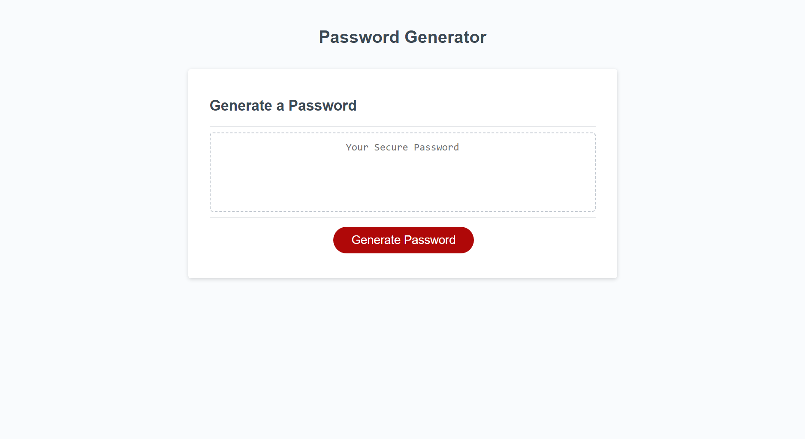

# Password Generator

My solution the module 5 challenge for the edX front-end bootcamp. It's a simple password generator that asks the user some questions.

## Usage
Open `index.html` in a web browser, or with the Live Server extension for Visual Studio Code.

## Credits
* `shuffle` provided by [freecodecamp](https://freecodecamp.org).
